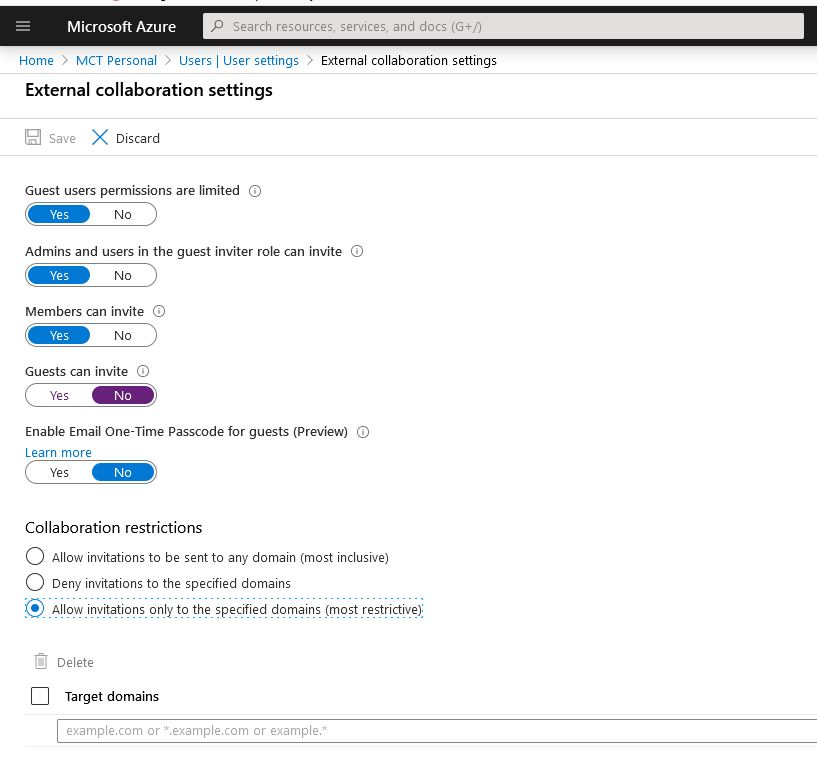

# Cheat

# Teams Help
https://docs.microsoft.com/en-us/microsoftteams/teams-overview

See logs:
**Ctrl + Alt + Shift + 1**

https://docs.microsoft.com/en-us/microsoftteams/log-files

# Access Reviews in Azure Active Directory

# Set  Teams - Skype Interoperability

https://docs.microsoft.com/en-us/powershell/module/skype/grant-csteamsupgradepolicy?view=skype-ps

# Team Usage

https://docs.microsoft.com/en-us/microsoftteams/teams-analytics-and-reports/teams-usage-report

# Coexistence Team

https://docs.microsoft.com/en-us/microsoftteams/teams-and-skypeforbusiness-coexistence-and-interoperability

# Call 

https://docs.microsoft.com/en-us/microsoftteams/create-a-phone-system-call-queue

# Messaging Policies
https://docs.microsoft.com/en-us/microsoftteams/messaging-policies-in-teams

# Direct Routing

https://docs.microsoft.com/en-us/microsoftteams/direct-routing-configure

# Stream for large nr in Teams

https://docs.microsoft.com/en-us/stream/network-overview
https://docs.microsoft.com/en-us/stream/ecdn

# Setup Org-Wide Team
https://docs.microsoft.com/en-us/microsoftteams/create-an-org-wide-team

# Message Policy 
https://docs.microsoft.com/en-us/microsoftteams/messaging-policies-in-teams

# Manage Custom App1
https://docs.microsoft.com/en-us/microsoftteams/teams-custom-app-policies-and-settings

# Modern Sharepoint
https://techcommunity.microsoft.com/t5/microsoft-sharepoint-blog/what-is-modern-sharepoint-and-why-should-i-care/ba-p/161941

# Prepare exam 
https://vladtalkstech.com/ms-700-study-guide-managing-microsoft-teams

